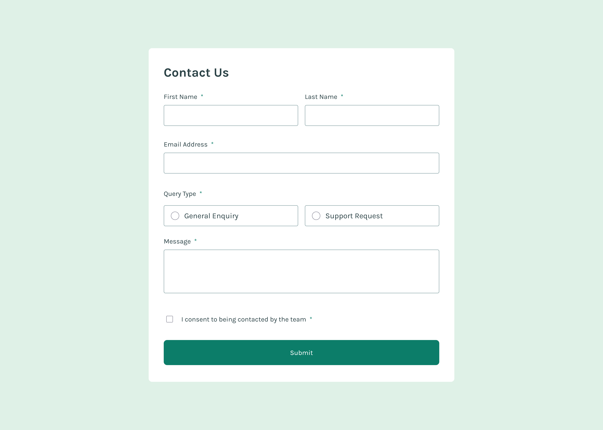

# Frontend Mentor - Contact form solution

This is a solution to the [Contact form challenge on Frontend Mentor](https://www.frontendmentor.io/challenges/contact-form--G-hYlqKJj). Frontend Mentor challenges help you improve your coding skills by building realistic projects. 

## Table of contents

- [Overview](#overview)
  - [The challenge](#the-challenge)
  - [Screenshot](#screenshot)
  - [Links](#links)
- [My process](#my-process)
  - [Built with](#built-with)
- [Author](#author)

## Overview

### The challenge

Users should be able to:

- Complete the form and see a success toast message upon successful submission
- Receive form validation messages if:
  - A required field has been missed
  - The email address is not formatted correctly
- Complete the form only using their keyboard
- Have inputs, error messages, and the success message announced on their screen reader
- View the optimal layout for the interface depending on their device's screen size
- See hover and focus states for all interactive elements on the page

### Screenshot

### Links

- Solution URL: [Gihub](https://github.com/TwoZer00/contact-form)
- Live Site URL: [Netlify](https://gorgeous-salmiakki-783199.netlify.app)

## My process

### Built with

- Solution URL: [GitHub](https://github.com/TwoZer00/multi-step-form-main)
- Live Site URL: [Live site](https://keen-malabi-cc1f80.netlify.app)

###

## Author

- Website - [twozer00.dev](https://twozer00.dev)
- Frontend Mentor - [@Two-Zer00](https://www.frontendmentor.io/profile/TwoZer00)